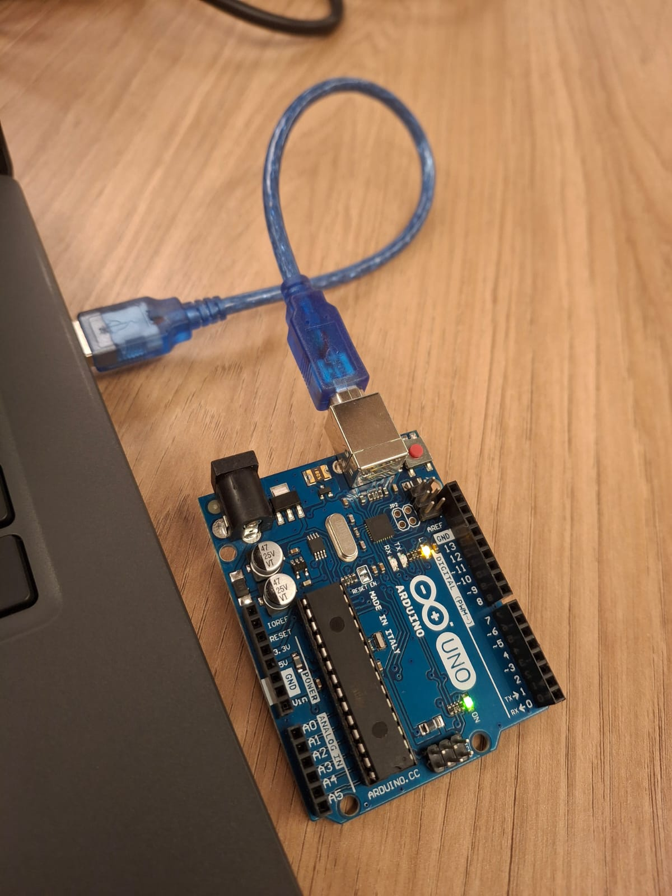
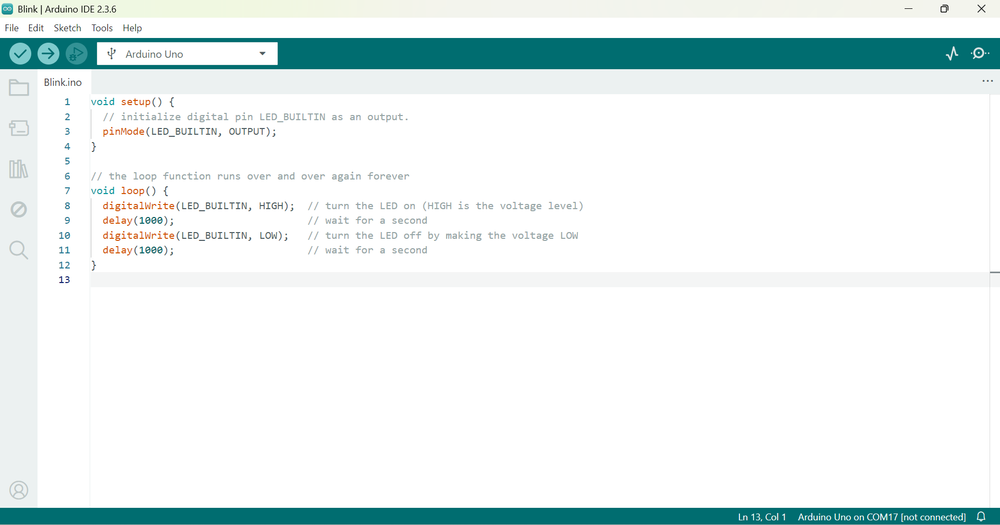
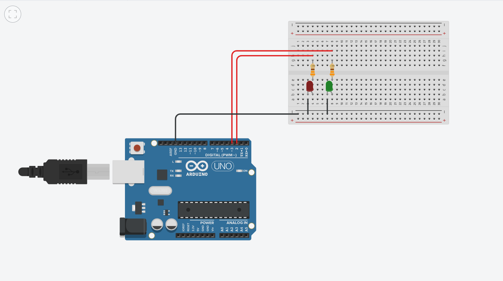

# Ponderada de Programação

## Blink Led Interno

Ao compilar o código pela IDE do Arduino, o led interno do microcontralador do Arduino fica aceso por 1 segundo e apagado por 1 segundo. Esse ciclo é repetido continuamente, até que o programa seja interrompido ou o Arduino seja desligado.

Abaixo tem-se uma imagem do Led aceso:



Código utilizado no arduino IDE:



> Para ter uma visualização melhor, basta acessar o link de um vídeo do Led piscando: [Vídeo do Led piscando](https://drive.google.com/file/d/1XWA8utSV7P_ULDkOaWtqCOtWRo7LbyaB/view?usp=sharing)

## Simulando Blink Externo

Para realizar a simulação do Blink externo, foi utilizado o software Tinkercad (plataforma online de simulação de circuitos eletrônicos). Além disso, foi utilizado dois Leds (azul e verde), o Led azul conectado na porta 2 e o Led verde conectado na porta 3, dois resistores de 330 ohms, um microcontrolador Arduino UNO e um protoboard.

Ao começar a simulação, o Led azul fica aceso por 1 segundo, enquanto o Led verde fica apagado. Após 1 segundo, o Led azul apaga e o Led verde acende por 1 segundo. Esse ciclo fica se repetindo continuamente, até que a simulação seja interrompida.

Abaixo tem-se a imagem do circuito montado no Tinkercad:



Código utilizado na simulação:

```cpp
void setup()
{
  pinMode(2, OUTPUT); // Led Azul
  pinMode(3, OUTPUT); // Led Verde
}

void loop()
{
  digitalWrite(2, 1); // Led Azul aceso
  digitalWrite(3, 0); // Led Verde apagado
  delay(1000);
  digitalWrite(2, 0); // Led Azul apagado
  digitalWrite(3, 1); // Led Verde aceso
  delay(1000);
}
```

> Para ter uma visualização melhor, basta acessar o link da simulação do circuito: [Simulação Blink Externo](https://www.tinkercad.com/things/eagrJWKWVtg-ponderada-semana-1/editel?returnTo=%2Fdashboard%2Fdesigns%2Fcircuits&sharecode=GCE-Ffxjwvo4Pvia2ejP-ZDb7XEsoRVFRg0X6QanuYM)