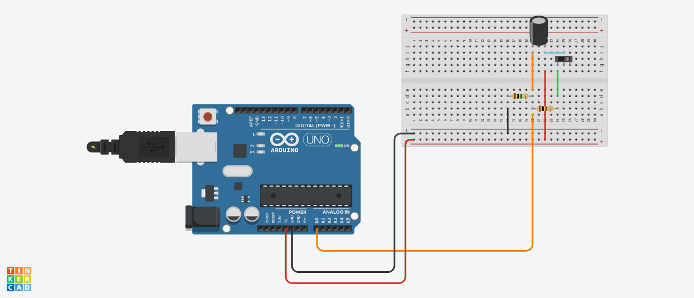
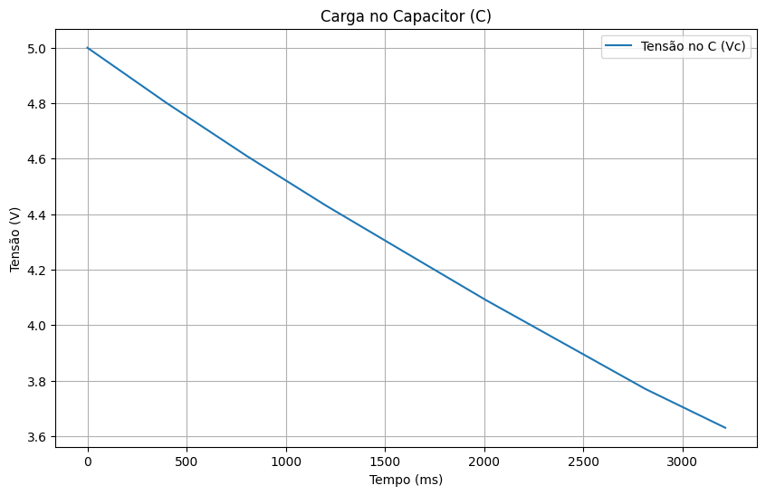
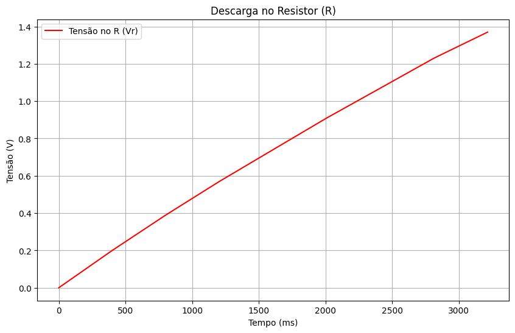
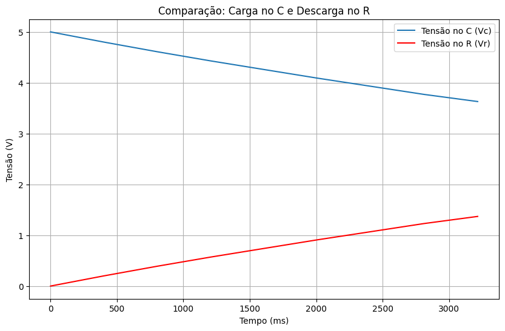

# Ponderada de Programação

## Simulando Carga de Capacitor e Descarga de Resistor

Para realizar a simulação da carga do Capacitor e descarga do Resistor, foi utilizado o software Tinkercad (plataforma online de simulação de circuitos eletrônicos). Além disso, foi utilizado 1 interruptor, dois resistores de 1 MEGA ohms e 100 ohms, um capacitor com 10uF e 25V, um microcontrolador Arduino UNO e um protoboard.

Ao começar a simulação, o interruptor é acionado manualmente pela plataforma. Após isso, o Capacitor começa a carregar e o Resistor começa a descarregar. Durante esse processo, o Valor Analógico é lido pelo Arduino na porta A0 e exibido no Monitor Serial. 

Abaixo tem-se a imagem do circuito montado no Tinkercad:



Código utilizado na simulação:
```cpp
int pinoNoRC=0; 
int valorLido = 0;
float tensaoCapacitor = 0, tensaoResistor;
unsigned long time; 
void setup(){ 
Serial.begin(9600); 
} 
void loop() { 
	time=millis(); 
	valorLido=analogRead(pinoNoRC); 
	tensaoResistor=(valorLido*5.0/1023); // 5.0V / 1023 degraus = 0.0048876 
	tensaoCapacitor = abs(5.0-tensaoResistor);
 	Serial.print(time); //imprime o conteúdo de time no MONITOR SERIAL
    Serial.print(" "); 
  	Serial.print(tensaoResistor);
  	Serial.print(" ");
  	Serial.println(tensaoCapacitor); 
	delay(400); 
}
```

Parte dos resultados Obtidos:
```cpp
0 5.00 0.00
401 4.80 0.20
803 4.61 0.39
1205 4.43 0.57
1607 4.26 0.74
2010 4.09 0.91
2412 3.93 1.07
...
```

Para melhor visualização dos dados coletados, foram gerados gráficos a partir do código feito em python usando os valores disponibilizados pelo Monitor Serial.

Gráfico da Carga do Capacitor:



Gráfico da Descarga do Resistor:



Gráfico da comparação entre a Carga do Capacitor e a Descarga do Resistor:

