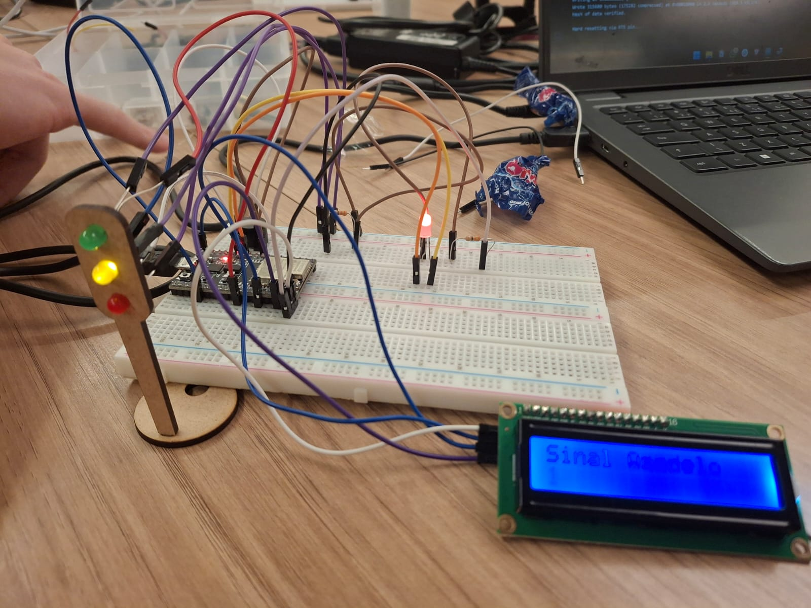
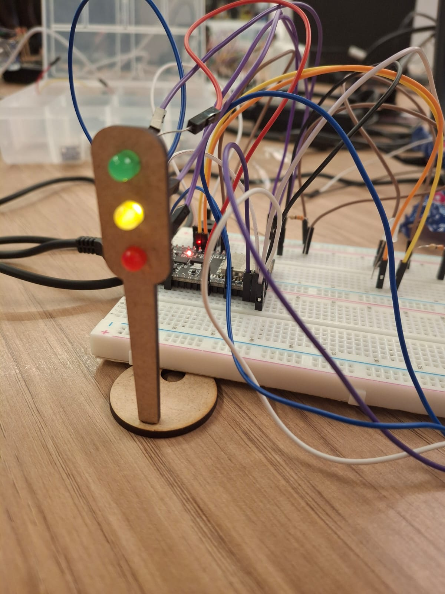
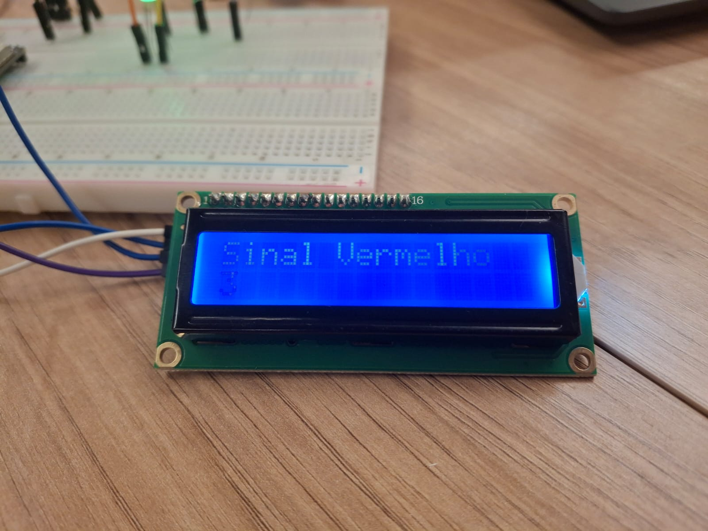
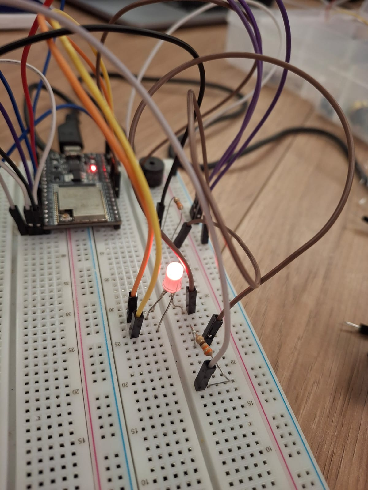
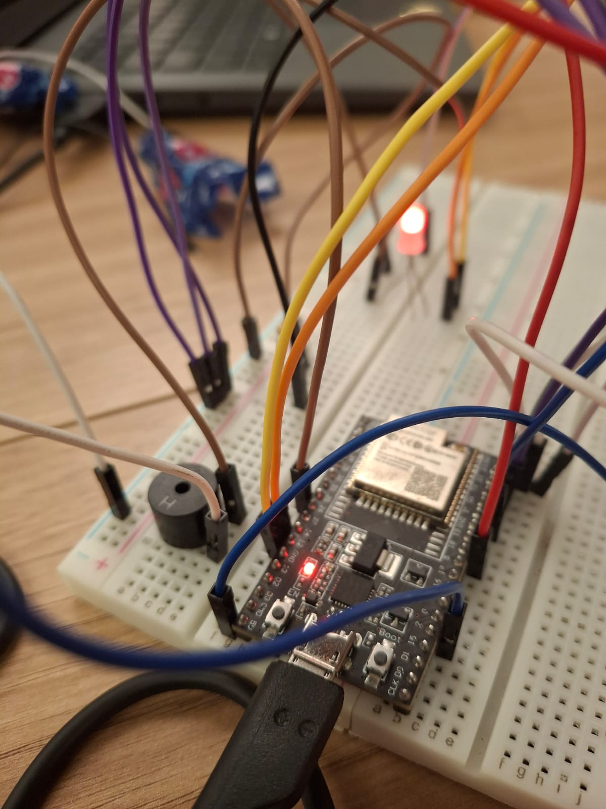

# Ponderada de Programação

## Programação e lógica do Semáforo

O projeto do semáforo foi desenvolvido utilizando o microcontrolador ESP32, que foi programado na IDE do Arduino. O semáforo possui dois sistemas: um para veículos e outro para pedestres, ambos controlados pelo microcontrolador ESP32.

Abaixo tem-se uma imagem do circuito montado:



Código utilizado no arduino IDE:

```cpp
#include <Wire.h>
#include <LiquidCrystal_I2C.h>

LiquidCrystal_I2C lcd(0x27, 16, 2);

void setup() {
  Serial.begin(115200);
  pinMode(12, OUTPUT); //LED RGB vermelho (pedestre não atravessa)
  pinMode(14, OUTPUT); //LED RGB verde (pedestre pode atravessar)
  pinMode(18, OUTPUT); //LED verde
  pinMode(2, OUTPUT); //LED amarelo
  pinMode(23, OUTPUT); //LED vermelho
  pinMode(25, OUTPUT); //Buzzer
  lcd.init();
  lcd.backlight();
}


void loop() {
  digitalWrite(14, 0);
  digitalWrite(23, 0);
  digitalWrite(18, 1);
  digitalWrite(12, 1);
  Serial.println("Nao atravesse!!");
  lcd.setCursor(0, 0);
  lcd.print("Sinal Verde");
  delay(4000);
  int cont1 = 7;
  for (int i = 0; i < 6; i++) {
    digitalWrite(18, 0);
    delay(500);
    digitalWrite(18, 1);
    delay(500);
    cont1--;
    lcd.setCursor(0, 1);
    lcd.print(cont1);
  }
  delay(500);
  lcd.clear();
  lcd.setCursor(0, 0);
  lcd.print("Sinal Amarelo");
  digitalWrite(18, 0);
  digitalWrite(2, 1);
  lcd.setCursor(0, 0);
  delay(2000);
  int cont2 = 7;
  for (int i = 0; i < 6; i++) {
    digitalWrite(2, 0);
    digitalWrite(12, 0);
    delay(500);
    digitalWrite(2, 1);
    digitalWrite(12, 1);
    delay(500);
    cont2--;
    lcd.setCursor(0, 1);
    lcd.print(cont2);
  }
  delay(500);
  lcd.clear();
  lcd.setCursor(0, 0);
  lcd.print("Sinal Vermelho");
  digitalWrite(2, 0);
  digitalWrite(12, 0);
  digitalWrite(23, 1);
  digitalWrite(14, 1);
  tone(25, 1000);
  delay(6000);
  int cont3 = 7;
  for (int i = 0; i < 6; i++) {
    digitalWrite(23, 0);
    digitalWrite(14, 0);
    delay(500);
    digitalWrite(23, 1);
    digitalWrite(14, 1);
    delay(500);
    cont3--;
    lcd.setCursor(0, 1);
    lcd.print(cont3);
  }
  delay(500);
  lcd.clear();
  noTone(25);
}
```

> Acesse o link para visualizar o funcionamento do circuito (montagem física): [Vídeo do funcionamento](https://drive.google.com/file/d/1A84Ky52XwMUsKidTFRVK2-BM5WLlkycr/view?usp=drive_link)

## Componentes Utilizados

Para a montagem do circuito, foram utilizados os seguintes componentes:

- Microcontrolador ESP32
- Display LCD 16x2
- LED RGB (Simbolizar o semáforo para pedestres)
- LEDs (vermelho, amarelo e verde) (simbolizar o semáforo para veículos)
- Buzzer
- Resistores de 330 ohms
- Protoboard
- Jumpers (Fios de conexão)

## Desenvolvimento do semáforo

O projeto foi desenvolvido utilizando os componentes listados acima. O microcontrolador ESP32 foi programado para controlar o funcionamento do semáforo, alternando entre os estados de verde, amarelo e vermelho para os veículos, e verde e vermelho para os pedestres.

Quando o sinal dos veículos estava verde (4 segundos aceso), o dos pedestres estava vermelho, indicando que não era seguro atravessar. Após um período de tempo, o sinal verde ficava piscando (6 segundos), alertando os motoristas de que o sinal iria mudar em breve. 

Em seguida, o sinal dos veículos mudava para amarelo (2 segundos aceso), e o sinal dos pedrestes ficava vermelho. Após isso, o sinal dos veículos ficava piscando amarelo (6 segundos), e o sinal dos pedestres piscava durante 6 segundos. 

Finalmente, o sinal dos veículos mudava para vermelho (6 segundos aceso), e o sinal dos pedestres mudava para verde, indicando que era seguro atravessar. 
Durante esse período, o buzzer emitia um som para alertar os pedestres. O sinal dos pedestres também ficava piscando verde (6 segundos) antes de mudar para vermelho novamente.

Todo esse ciclo é mostrado no display LCD, que exibe mensagens como "Sinal Verde", "Sinal Amarelo" e "Sinal Vermelho", juntamente com uma contagem regressiva (quando os sinais estavam prestes a mudar) para os pedestres.

## Avaliação

O João Vitor do grupo 3 fez uma avaliação do projeto do semáforo desenvolvido. Ele disse que o projeto está muito bom, com uma ideia muito boa de utilizar o display LCD para mostrar as mensagens e a contagem regressiva para os pedestres. Além disso, ele disse que o buzzer foi uma ótima ideia de sinalização para os pedestres saberem que é o momento certo para atravessar. No geral, ele elogiou o trabalho realizado.

O Rafael Josué do grupo 2 também fez uma avaliação do projeto. Ele disse que nao achou nada de errado no circuito em questao de conexão. Ele disse que o ir além de colocar o funcionamento do sinal de semáforo com o de pedestres, o uso do display LCD para mostrar as mensagens e a contagem foi ir além muito bom.

## Imagens Extras

LEDs que simbolizam o semáforo para veículos:



Display LCD que mostra as mensagens e a contagem regressiva:



LED RGB que simboliza o semáforo para pedestres:



Buzzer para sinalizar de forma sonora que o pedestre pode atravessar e microcontrolador ESP32 utilizado no projeto:

