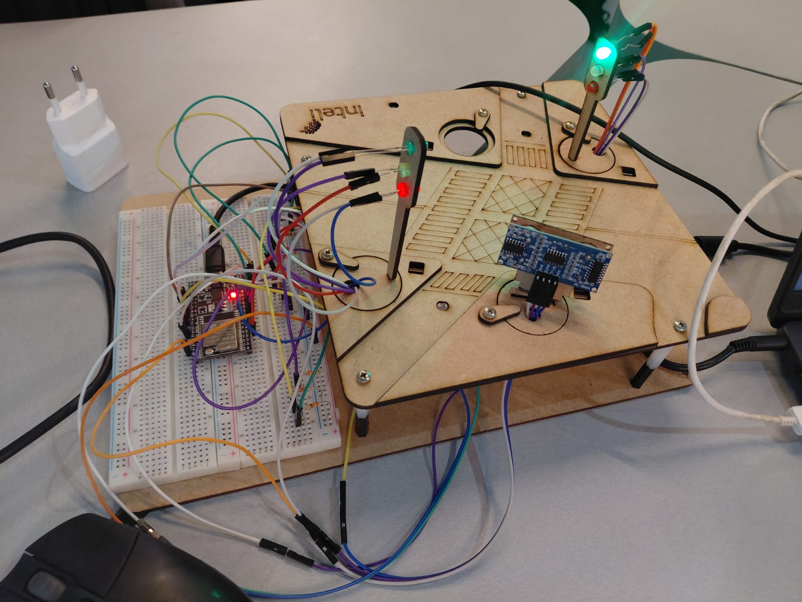

# 🚦 Projeto: Semáforo Inteligente com Detecção de Infração

> Para visualizar o circuito montado e os testes feitos, mostrando o funcionamento dos sensores e a integração com o Ubidots, acesse o seguinte vídeo: [Vídeo do Projeto](https://drive.google.com/file/d/1HofJvlOPtPIigSPnbYK9-d2YWvgBJAEg/view?usp=sharing)

Este projeto foi desenvolvido na semana 6, com o objetivo de explorar conceitos de Smart Cities. A proposta é criar um sistema de semáforos adaptativos que não apenas gerencia o fluxo, mas também monitora o comportamento dos motoristas.

O sistema utiliza:
1.  Um *Sensor de Luz (LDR)* para identificar e ativar o "Modo Noturno".

2.  Um *Sensor de Distância (Ultrassônico)* para detectar veículos que avançam o sinal vermelho.

3.  Uma integração com a plataforma *Ubidots (IoT)* para exibir as fases dos semáforos e registrar infrações (multas) em tempo real.

4. Dois semáforos para veículos com três LEDs cada (vermelho, amarelo e verde).

5. 6 resistores de 330 ohms para os LEDs e 1 resistor de 10k ohms para o sensor LDR. 

---

## Membros Responsáveis do Grupo

- Catarina Sayuri - [ <a href="https://www.linkedin.com/in/catarina-sayuri?utm_source=share&utm_campaign=share_via&utm_content=profile&utm_medium=ios_app">Linkedin</a> | <a href="https://github.com/catarinaSayuri">GitHub</a> ]
- Enzo Matsui - [ <a href="https://www.linkedin.com/in/enzo-b-matsui/">Linkedin</a> | <a href="https://github.com/Matsu-iy">GitHub</a> ]
- Gabriel Reis - [ <a href="https://www.linkedin.com/in/gabriel-reis-07170727b/">Linkedin</a> | <a href="https://github.com/GabriellReisss">GitHub</a> ]
- João Victor Furtado - [ <a href="https://www.linkedin.com/in/jo%C3%A3o-vitor-furtado-de-freitas-4b1974244/">Linkedin</a> | <a href="https://github.com/JoaoFurtadoFreitas">GitHub</a> ]
- Nicole Neves - [ <a href="https://www.linkedin.com/in/nicoleriedla/">Linkedin</a> | <a href="https://github.com/nicriedla">GitHub</a> ]
- Rafael Campos - [ <a href="https://www.linkedin.com/in/rafael-figueiredo-campos-72131735b/">Linkedin</a> | <a href="https://github.com/Rafael-Campos538">GitHub</a> ]
- Vinícius Cadena - [ <a href="https://github.com/ViniCadena1405">GitHub</a> ]

---

## Parte 1: Montagem Física e Lógica

Nesta etapa, foi realizada a montagem de dois semáforos e a integração de dois tipos de sensores para diferentes finalidades.

### Componentes Utilizados

* Microcontrolador ESP32
* LEDs (2 Verdes, 2 Amarelos, 2 Vermelhos)
* 6 Resistores de 330 ohms para os leds e 1 resistor de 10k ohms para o sensor LDR
* Sensor de distância (Ultrassônico)
* Sensor de Luz (LDR)
* Protoboard e Jumpers

### Funcionamento dos Sensores

O sistema utiliza dois sensores com lógicas distintas:

1.  *Sensor de Luz Ambiente (LDR):* Mede a luminosidade geral do ambiente. Quando o sensor detecta que o nível de luz está abaixo de 100, o sistema entende que "anoiteceu" e ativa automaticamente o *Modo Noturno* (os sinais amarelos começam a piscar em conjunto).

2.  *Sensor de Distância (Ultrassônico):* Este sensor faz a verificação da ´passagem dos veículos no sinal vermelho. Logo, se um veículo parar ou passar quando sinal estiver fechado (vermelho), o sistema registra uma infração (multa).

### Lógica da Infração (Multa)

A lógica para registrar a multa é uma condição específica no código:
* *SE* o estado_semaforo for VERMELHO
* *E* o Sensor Ultrassônico detectar que o veículo ultrapassou o limite de distância (indicando que o carro está na faixa de pedestres)
* *ENTÃO* o sistema incrementa uma variável contador_multas e envia esse novo valor imediatamente para o Ubidots.

---

## Parte 2: Interface Online com Ubidots

Para transformar o semáforo em um dispositivo IoT, utilizamos a plataforma Ubidots. Ela serve como nosso painel de controle, permitindo monitoramento remoto e registro de dados.

### Dashboard de Monitoramento

Nosso dashboard no Ubidots foi configurado para exibir três informações principais:

1.  *Fases:*
    Fase 1: quando um semaforo estiver com sinal verde, o outro estará com sinal vermelho.
    Fase 2: quando um semaforo estiver com sinal amarelo, o outro estará com sinal vermelho.
    Fase 3: quando um semaforo estiver com sinal vermelho, o outro estará com sinal verde.
    Fase 4: quando o sensor LDR detectar que o nível de luz está alto (modo diurno), ambos os semáforos piscam o led amarelo.

2.  *Detecção e Registro de Multas:*
    Criamos uma variável chamada event no Ubidots. Esta variável é incrementada toda vez que o sensor ultrassônico detecta um veículo passando no sinal vermelho. Cada vez que isso ocorre, o contador de multas é atualizado e enviado para o Ubidots, permitindo um monitoramento das infrações.

3. *Sensor LDR:*
    A variável do sensor LDR também foi integrada ao Ubidots, permitindo monitorar os níveis de luz ambiente em tempo real. Isso ajuda a entender quando o sistema entra no modo noturno.

---

### Anexos

Foto da montagem do circuito, mostrando os dois semáforos, o LDR de luz ambiente e o Sensor Ultrassônico.

